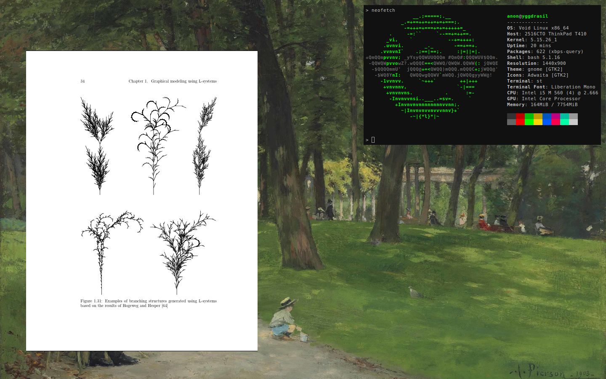

# WM - X11 Window Manager

The following repository implements a minimalist, keyboard-driven, X11 window manager featuring workspaces and tiling. 

For something less homebrew, check out [dwm](https://dwm.suckless.org/) or [i3](https://i3wm.org/)

**Key Bindings**

    Super + Enter            Terminal
    Super + d                Menu
    Super + Shift + q        Quit
    
    Super + q                Kill window
    Super + Tab              Cycle focus
    Super + Shift + Tab      Cycle focus backwards
    Super + f                Fullscreen window
    Super + h/j/k/l          Tile window

    Super + [1-9]            Switch workspace
    Super + Shift + [1-9]    Move window to workspace